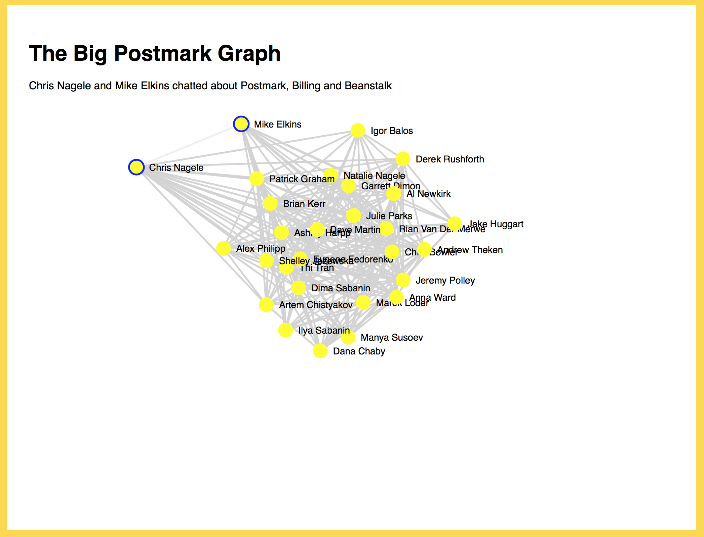

# Postmark Full-Stack Developer Test Project

Hi! Thank you for your interest in the full-stack developer position at ActiveCampaign's Postmark team. We ask that you complete a small test project for us to better understand how you approach problems. It’ll also allow us to appreciate your command of the technologies that we use at work 🙂

## Setting things up

This repository contains a Rails app with a React frontend. To get started, follow these steps:

* `cp .env-example .env` and update the `.env` file with the Postmark Server API token you have been assigned.
* Install the Ruby version found in [.ruby-version](/.ruby-version) (we like to use [RVM](https://rvm.io)).
* Install [NVM](https://github.com/creationix/nvm).
* Run `nvm install` in the repository root.
* Install [Yarn](https://yarnpkg.com/en/docs/install) (required by Webpacker).
* Depending on your platform, you might need to install libsqlite3 for SQLite support.
* Run `bin/setup`.

To verify that your dev environment is set up correctly, run the Rails server and open [http://localhost:3000/](http://localhost:3000/) in your browser.

``` bash
# Running the Rails server

$ bin/rails server
```

Additionally, run the Rake task that you’ll need to modify.

``` bash
$ bin/rake snapshot:take

This Rake task doesn’t do much right now. It’s only got a few pointers to get you started!
```

👋 Drop us a note if you’re having trouble setting it up or if something can be better explained. We’re trying to make this experience as smooth as possible.

## Your assignment

You’re given access to a Postmark server ([?](https://postmarkapp.com/support/article/1105-an-introduction-to-postmark-servers)) used by some 3rd party app to send private message notifications to its users (a common use case for Postmark). The test app will build and present the network of communications within the community of the app’s users.

The app’s boilerplate consists of a Rake task `snapshot:take` that takes a (say, nightly) snapshot of all in-app communications, the `Snapshot` model that stores all in-app communications up to the time it was taken, a Rails controller that serves the latest communications snapshot, and a React view that presents this data to the end user (us 🙂).

#### 1. Modify the `lib/tasks/snapshot.rake` Rake task that creates a snapshot of the in-app communications

Use the [Postmark Messages API](https://github.com/wildbit/postmark-gem/wiki/Messages) to build and save an instance of the `Snapshot` (`app/models/snapshot.rb`) model. Make sure to use *all available* messages for the snapshot. Note that the model doesn’t specify the format of the communications snapshot. Use your own judgment to pick one. Keep in mind that a good data format picked here will save you time on step #2.

#### 2. Modify the React component in `app/javascript/packs/graph.jsx` to show the in-app communications as a graph.

Until your first snapshot is taken, the component will show the data hard-coded in the `graph.jsx` file. Your task is to feed the snapshot data to this React component so that it shows a network of in-app communications where each node is a person and each connection is a message from one person to another. When the user highlights a line connecting two users, the inspector component should display the topics the two chatted about. See the screenshot below for an example.

#### 3. Submit your solution along with a write-up touching on things such as:
- thoughts behind the chosen approach
- any tradeoffs/compromises made



## How we will check assignments

1. We will run `bundle install` and `yarn install` to make sure that the dependencies are up-to-date. We don’t think you’ll need to add any extra dependencies, but you have this option if you miss something.
2. We will take a fresh snapshot using the `bin/rake snapshot:take` command.
3. We will then run `bin/rails server` and open the [http://localhost:3000/](http://localhost:3000/) URL.
4. Once we’re sure that the app works as expected, we’ll take a look at the implementation. See below for what we’re looking at.

First and foremost, we look for a complete and correct implementation of each task listed in the assignment. To increase your chances, make your submission easy to read, follow Ruby and Rails idioms, and use system and network resources efficiently where it matters (but don’t sacrifice readability!).

A note on creativity: feel free to get creative and add a personal touch to your submission. While we don’t filter candidates based on how much work they put into the test project, some extra care can go a long way and even make up for a mistake or a lack of experience in a different area.

Good luck! 🖖

---
## Notes:


Thank you for the opportunity to work on the test project. 

### For the Communication Format:

- Data is organized into a graph structure, where users and the communications between them are represented as nodes and links, respectively.
- Helper methods are utilized to extract and process information from messages.
- To facilitate visualization, the decision was made to consolidate multiple communications between two users into a single link with various topics, whenever the source and target are the same but with different topics.

For example, instead of having two separate links:

  - `{source: "Kendrick Johnson", target:"Lavern Heaney", topic: "Dmarc Digests"}`
  - `{source: "Kendrick Johnson", target:"Lavern Heaney", topic: "Beanstalk"}`

A single link between Kendrick Johnson and Lavern Heaney is displayed with both topics in the inspector:

  - Dmarc Digests , Beanstalk

The connection is constructed as follows:

```markdown
link: 
  { 
    source: "Kendrick Johnson", 
    target:"Lavern Heaney", 
    topics:"Dmarc Digests, Beanstalk" 
  }
```


### Backend Testing (Ruby on Rails)


#### 1. **Unit Tests**
Verify the functionality of individual models and methods in the Rails application. Frameworks like `RSpec` are used. Tests for models (e.g., `Snapshot`) should ensure proper data handling and storage mechanisms.

#### 2. **Controller Tests**
Ensure your controllers correctly process incoming requests and return the expected responses. This includes testing for correct routing, parameter handling, and HTTP response statuses.

#### 3. **Rake Task Tests**
Given the project includes a Rake task (`snapshot:take`) for taking snapshots of in-app communications, it's crucial to test this task's execution and functionality.

## Frontend Tests

### Graph Component

These tests utilize `@testing-library/react` for rendering components and simulating user interactions.

#### Rendering Test

- **Renders the App component with mock data**: Verifies that the `graph` component correctly renders nodes and initial instructions for user interaction. This test uses a set of dummy snapshot data to simulate the application state and checks if the node elements and initial help text are present in the document.

#### Interaction Test

- **Updates the inspector when hovering over a link**: Ensures that when a user hovers over a connection line between nodes, the inspector updates to display the correct information. This test simulates a mouseOver event on a link and checks if the inspector reflects the topics discussed between the two connected nodes.

#### Node Rendering Test

- **Renders nodes correctly within the Graph**: Confirms that each node specified in the snapshot data is rendered on the screen. This ensures the graph's visual representation matches the underlying data structure.

### Testing Strategy

- After each test, cleanup is performed to reset the environment, ensuring no residual data affects subsequent tests.
- Mock data is used to represent a snapshot of in-app communications, consisting of nodes (users) and links (connections) with associated topics.
- Interaction with the graph's elements, such as hovering over links, is simulated to test dynamic updates to the UI.


## Backend Tests

### Snapshot Model

Testing the `Snapshot` model involves ensuring that it correctly represents the structure of in-app communications data after interacting with the Postmark API. The following tests are designed to verify the integrity of the Snapshot creation process.

#### Snapshot Creation Test

- **Creates a new Snapshot with correct data structure**: This test confirms that invoking `Snapshot.take` results in a new `Snapshot` instance populated with data that mirrors the structure expected from the Postmark API's responses. Mock responses simulate incoming data, and the test verifies that the snapshot contains the correct nodes and links, reflecting the communications network.

#### Test Data Preparation

A simulated response from the Postmark API is used to provide a reliable input for testing. This ensures that the `Snapshot` model's `.take` method can process and store data correctly, regardless of changes or inconsistencies in live data.

#### Data Verification

The test asserts that:
- A `Snapshot` instance is created and is not nil.
- The `data` attribute of the `Snapshot` instance contains `nodes` and `links` as expected.
- The `nodes` and `links` match the structure and content expected from the Postmark API response, including the correct identification of message senders (sources) and recipients (targets), as well as the topics of communication.

#### Mocking External Services

External calls to the Postmark API are mocked to prevent live network calls during testing, thereby increasing test speed and reliability.

### Testing Strategy

These tests are implemented using RSpec, and they rely on the `Postmark::ApiClient` to mock interactions with the Postmark API. The `Snapshot` model's `.take` method is then invoked, and its output is compared against the expected data structure, ensuring the model behaves as required.


